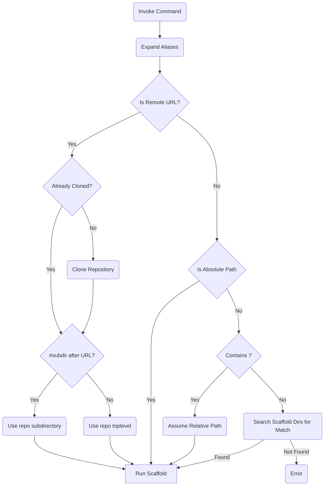

---
---

# Scaffold Resolution

Scaffold uses a resolution system to find the correct scaffold to use when generating a project. This system may seem _complicated_ at first, however I reason that it is flexible enough to handle most use cases without being overly un-intuitive.

## Short summary

The scaffold argument can be one of the following

- A scaffold name without slashes in it, e.g. `my-scaffold`. This will be looked up under
  under `./.scaffold/<name>`
- A local absolute path, e.g. `$HOME/scaffolds/my-scaffold`
- A local relative path, e.g. `./local-scaffolds/my-scaffold` or `../shared-scaffolds/my-scaffold`
- A remote repo url, e.g. `https://github.com/hay-kot/scaffold-go-cli`
- A remote repo subdirectory, e.g. `https://github.com/org/repo#subdirectory`

> Note that the resolved path must have a `scaffold.yaml` or `scaffold.yml` [configuration file](../templates/scaffold-file.md) present

## Full resolution diagram

