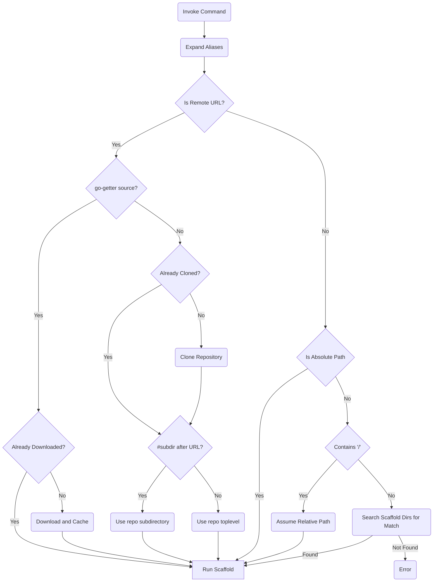

---
---

# Scaffold Resolution

Scaffold uses a resolution system to find the correct scaffold to use when generating a project. This system may seem _complicated_ at first, however I reason that it is flexible enough to handle most use cases without being overly un-intuitive.

## Short summary

The scaffold argument can be one of the following

- A scaffold name without slashes in it, e.g. `my-scaffold`. This will be looked up under
  under `./.scaffold/<name>`
- A local absolute path, e.g. `$HOME/scaffolds/my-scaffold`
- A local relative path, e.g. `./local-scaffolds/my-scaffold` or `../shared-scaffolds/my-scaffold`
- A remote repo url, e.g. `https://github.com/hay-kot/scaffold-go-cli`
- A remote repo subdirectory, e.g. `https://github.com/org/repo#subdirectory`
- A remote archive or [go-getter](https://github.com/hashicorp/go-getter)
  source, e.g. `https://example.com/scaffold.zip//scaffold-main`

> Note that the resolved path must have a `scaffold.yaml` or `scaffold.yml` [configuration file](../configuration/scaffold-file.md) present

## Non-Git remote sources

Scaffold uses go-getter for HTTP archives, S3, GCS, and sources that use
go-getter's forced-protocol or `//subdirectory` syntax:

```sh
# Extract a scaffold subdirectory from an HTTP archive
scaffold new 'https://example.com/scaffolds.zip//scaffolds/go'

# Force an ambiguous HTTP archive to use the HTTP downloader
scaffold new 'http::https://artifactory.example.com/scaffolds/latest?archive=zip'

# Download a directory from S3
scaffold new 's3::https://s3.amazonaws.com/my-bucket/scaffolds/go'

# Download a directory from GCS
scaffold new 'gcs::https://www.googleapis.com/storage/v1/my-bucket/scaffolds/go'
```

Normal Git URLs continue to use Scaffold's existing Git resolver, including
the `@version` and `#subdirectory` syntax. Downloaded sources are cached by
their complete source reference.

## Full resolution diagram


```mermaid
graph TD;
  A(Invoke Command) --> B(Expand Aliases);
  B --> C{Is Remote URL?}
  C --> |Yes| K{go-getter source?};
  K --> |Yes| L{Already Downloaded?};
  L --> |Yes| Z;
  L --> |No| M(Download and Cache);
  M --> Z;
  K --> |No| D{Already Cloned?};
  D --> |Yes| repo_subdir_choice;
  D --> |No| E(Clone Repository);
  E --> repo_subdir_choice;

  repo_subdir_choice{#subdir after URL?}

  repo_subdir_choice --> |Yes| use_repo_subdir(Use repo subdirectory)
  repo_subdir_choice --> |No| use_repo_toplevel(Use repo toplevel)

  use_repo_subdir --> Z
  use_repo_toplevel --> Z

  C --> |No| F{Is Absolute Path};
  F --> |Yes| Z;

  F --> |No| G{Contains '/'};
  G --> |Yes| H(Assume Relative Path);
  H --> Z;

  G --> |No| I(Search Scaffold Dirs for Match);
  I --> |Found| Z;
  I --> |Not Found| J(Error);

  Z[Run Scaffold];
```
